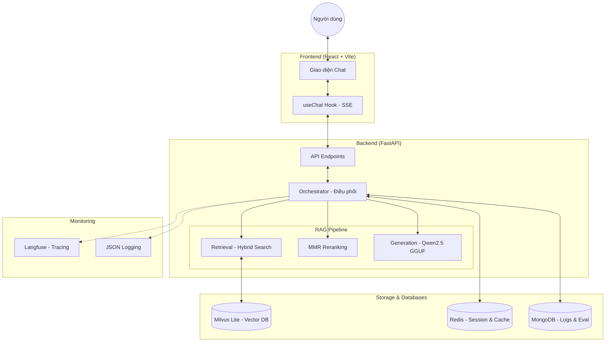

# Project Architecture – NEU Connect (Legal RAG)

Tài liệu này mô tả chi tiết kiến trúc hệ thống của dự án NEU Connect, một hệ thống RAG (Retrieval-Augmented Generation) tra cứu quy chế nội bộ.

---

## 1. Tổng quan hệ thống (High-Level Architecture)

Hệ thống được thiết kế theo mô hình Client-Server hiện đại, tách biệt Frontend (React) và Backend (FastAPI), kết hợp với các cơ sở dữ liệu chuyên dụng.

---

## 2. Quy trình xử lý RAG (Pipeline Flow)

Khi người dùng gửi một câu hỏi, hệ thống thực hiện các bước sau:

1.  **Query Processing**: Tiếp nhận query và tạo trace ID.
2.  **Hybrid Retrieval**:
    *   **Dense Search**: Sử dụng `vietnamese-sbert` để tìm kiếm ngữ nghĩa trên Milvus.
    *   **Sparse Search**: Sử dụng BM25 để tìm kiếm từ khóa chính xác.
    *   **Reciprocal Rank Fusion**: Kết hợp kết quả từ cả hai phương thức.
3.  **Reranking & Filtering**:
    *   Sử dụng thuật toán **MMR (Maximal Marginal Relevance)** để chọn ra các đoạn văn bản có độ liên quan cao nhưng không bị trùng lặp nội dung.
    *   **Lost-in-the-middle Reorder**: Sắp xếp lại các đoạn văn bản quan trọng nhất ra hai đầu của context để LLM xử lý tốt hơn.
4.  **Context Caching**: Lưu context vào Redis để phục vụ streaming và lịch sử.
5.  **Streaming Generation**: 
    *   Sử dụng model **Qwen2.5-7B-Instruct (GGUF)** chạy cục bộ qua `llama-cpp-python`.
    *   Trả về từng token cho người dùng qua **SSE (Server-Sent Events)**.
6.  **Post-processing**: Lưu log vào MongoDB và đồng bộ trace lên Langfuse.

---

## 3. Thành phần công nghệ (Tech Stack)

*   **Frontend**: React.js, Vite, CSS Modules, React Markdown.
*   **Backend**: Python 3.11, FastAPI, Uvicorn.
*   **LLM Engine**: llama-cpp-python (hỗ trợ Metal GPU trên Mac).
*   **Vector Database**: Milvus Lite (file-based cho development).
*   **NoSQL Databases**: 
    *   Redis: Quản lý session và lưu trữ context tạm thời.
    *   MongoDB: Lưu trữ lịch sử chat phục vụ đánh giá (Evaluation).
*   **Embedding**: `keepitreal/vietnamese-sbert`.
*   **Monitoring**: Langfuse (Tracing), Structured Logging (JSON).
*   **CI/CD**: GitHub Actions, Docker.

---

## 4. Kiến trúc triển khai (Deployment Architecture)

Dự án hỗ trợ chạy Docker hóa hoàn toàn:

*   **Dockerfile**: Multi-stage build (Build React -> Build Python).
*   **Volumes**: Mount thư mục `LLM/` (chứa model nặng) và `data/` (chứa database) để đảm bảo dữ liệu không bị mất khi container restart.
*   **CI/CD**: Tự động test và build image đẩy lên Docker Hub mỗi khi có cập nhật.
